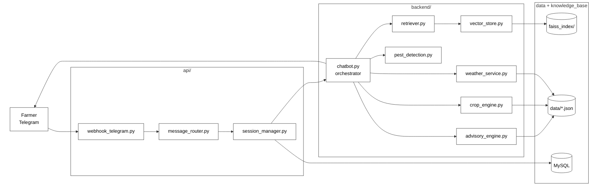
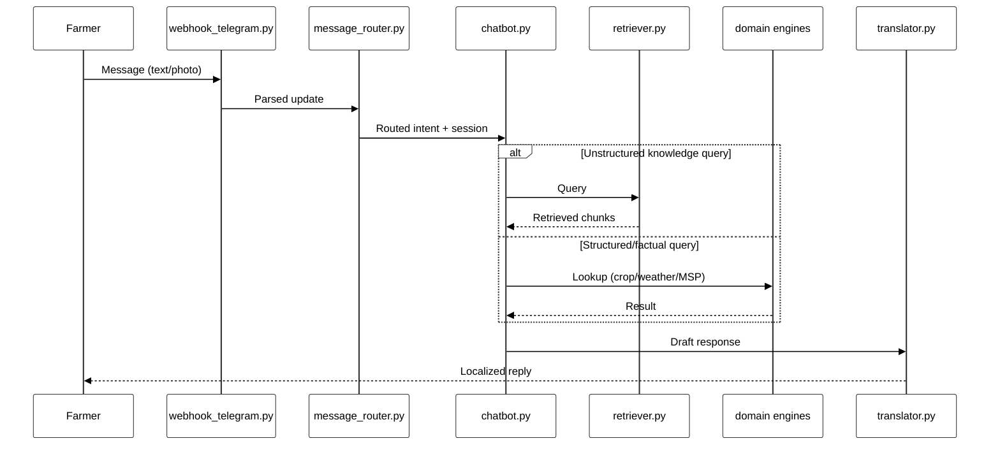
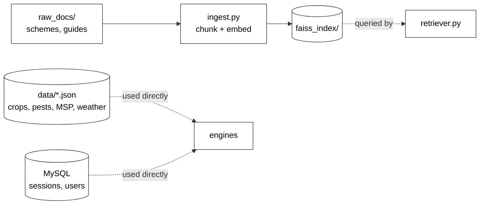

# Agri-Advisor — Architecture & System Design

A Telegram-based agricultural advisory assistant for farmers in Bihar. Combines retrieval-augmented generation (RAG) over unstructured knowledge (government schemes, disease guides) with structured lookups (crop data, MSP prices, weather thresholds) and image-based pest detection, delivered in the farmer's own language.

## Table of contents

- [High-level architecture](#high-level-architecture)
- [Request flow](#request-flow)
- [Knowledge & data layer](#knowledge--data-layer)
- [Project structure](#project-structure)
- [Component reference](#component-reference)
- [Tech stack](#tech-stack)
- [Design notes](#design-notes)
- [Roadmap](#roadmap)

## High-level architecture



## Request flow

A single farmer message moves through the system as follows:

1. **`webhook_telegram.py`** receives the incoming Telegram update (text or image).
2. **`message_router.py`** classifies intent — general question, pest photo, price lookup, weather query — and routes accordingly.
3. **`session_manager.py`** loads/updates conversation state (language, location, crop context) from MySQL.
4. **`chatbot.py`** orchestrates the response:
   - Unstructured questions (scheme eligibility, disease symptoms) → **`retriever.py`** queries the FAISS index in `faiss_index/` via **`vector_store.py`**.
   - Structured/factual questions (today's MSP, weather thresholds) → **`crop_engine.py`** / **`weather_service.py`** read directly from `data/*.json`, bypassing retrieval.
   - Image messages → **`pest_detection.py`** runs classification on the uploaded photo via **`media_handler.py`**.
   - **`advisory_engine.py`** combines engine outputs with retrieved context to produce the final recommendation.
5. **`translator.py`** converts the response into the farmer's preferred language before sending.
6. Reply is sent back through the Telegram Bot API.



## Knowledge & data layer

Ingestion is a separate, offline pipeline from the live query path:



| Store | Contents | Access pattern |
|---|---|---|
| `faiss_index/` | Embedded chunks of scheme/disease documents | Semantic search via `retriever.py` |
| `data/*.json` | Crop calendars, MSP prices, pest data, weather thresholds | Direct structured lookup — no embedding needed |
| MySQL | Session state, user profile, conversation history | Read/write per message via `session_manager.py` |

**Why the split:** RAG is reserved for genuinely unstructured, prose-form knowledge (scheme eligibility text, disease descriptions). Anything with an exact, structured answer — today's MSP for wheat, a weather alert threshold — is served straight from JSON/MySQL. This keeps factual answers deterministic and avoids retrieval latency/hallucination risk where it isn't needed.

## Project structure

```
AGRI-ADVISOR/
├── api/
│   ├── __init__.py
│   ├── message_router.py      # Intent classification & routing
│   ├── session_manager.py     # Conversation state (MySQL-backed)
│   └── webhook_telegram.py    # Telegram webhook entrypoint
├── backend/
│   ├── advisory_engine.py     # Combines retrieval + engine outputs
│   ├── chatbot.py             # Main orchestrator
│   ├── crop_engine.py         # Crop calendar / recommendation logic
│   ├── pest_detection.py      # Image-based pest classification
│   ├── retriever.py           # FAISS query interface
│   ├── vector_store.py        # FAISS index wrapper
│   └── weather_service.py     # Weather data + alerts
├── data/
│   ├── bihar_crops.json
│   ├── diseases_data.json
│   ├── govt_schemes.json
│   ├── msp_prices.json
│   ├── pest_data.json
│   └── weather_thresholds.json
├── faiss_index/               # Persisted vector index
├── knowledge_base/
│   ├── raw_docs/              # Source documents for ingestion
│   └── ingest.py              # Chunk + embed + index pipeline
├── utils/
│   ├── config.py
│   ├── logger.py
│   ├── media_handler.py       # Image download/preprocessing
│   └── translator.py          # Multilingual support
├── app.py                     # App entrypoint
├── telegram_bot.py            # Bot initialization
├── test_rag.py                # Retrieval evaluation
├── requirements.txt
└── .env
```

## Component reference

| Module | Responsibility |
|---|---|
| `webhook_telegram.py` | Receives Telegram updates, validates payload |
| `message_router.py` | Determines intent (Q&A, image, price/weather lookup) |
| `session_manager.py` | Tracks per-user conversation state and history |
| `chatbot.py` | Orchestrates retrieval + engines, assembles final reply |
| `retriever.py` | Embeds query, searches FAISS index, returns top-k chunks |
| `vector_store.py` | Thin wrapper around the FAISS index (load/query/update) |
| `advisory_engine.py` | Merges retrieved context with engine outputs into advice |
| `crop_engine.py` | Crop calendar, sowing/harvest recommendations |
| `pest_detection.py` | Classifies pest/disease from an uploaded photo |
| `weather_service.py` | Fetches/interprets weather data against thresholds |
| `ingest.py` | Offline pipeline: raw docs → chunks → embeddings → FAISS |
| `translator.py` | Translates responses into the farmer's language |
| `media_handler.py` | Downloads and preprocesses incoming images |
| `config.py` / `logger.py` | Configuration and logging utilities |
| `test_rag.py` | Evaluation harness for retrieval quality |

## Tech stack

- **Bot platform:** Telegram Bot API
- **Vector store:** FAISS (local, file-based index)
- **Relational store:** MySQL (sessions, users)
- **Structured data:** JSON files (crop/pest/weather/scheme reference data)

## Design notes

- **RAG vs. structured lookup:** Unstructured knowledge (scheme text, disease descriptions) goes through the retriever; anything with an exact answer (MSP price, weather threshold) is served directly from `data/*.json` or MySQL to keep those answers deterministic.
- **Pest detection is a separate pipeline** from text RAG — it's a vision classification step, not a retrieval step, triggered when the incoming message contains an image.
- **Ingestion is offline** — `ingest.py` rebuilds/updates `faiss_index/` independently of the live request path, so index updates don't block user-facing latency.

## Roadmap

- [ ] Add retrieval quality metrics (recall@k) to `test_rag.py` against a golden set of farmer questions
- [ ] Evaluate migrating high-churn JSON data (MSP prices) into MySQL for easier updates
- [ ] Add monitoring/logging around retrieval misses and low-confidence answers
- [ ] Document `.env` / `config.py` required variables
