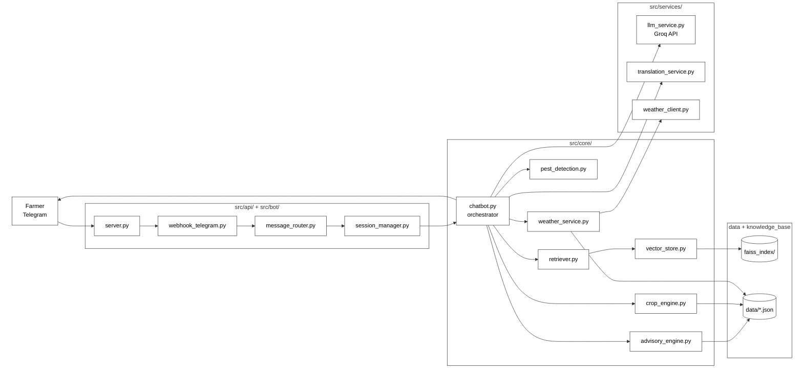
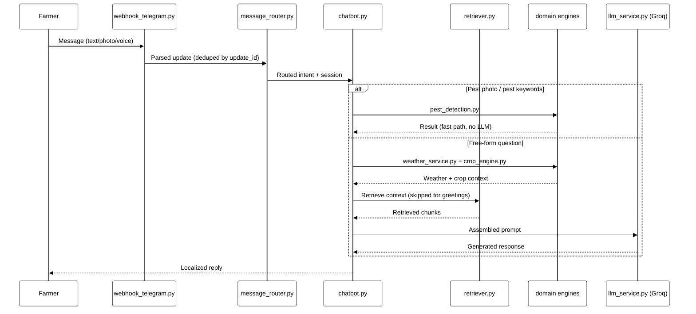
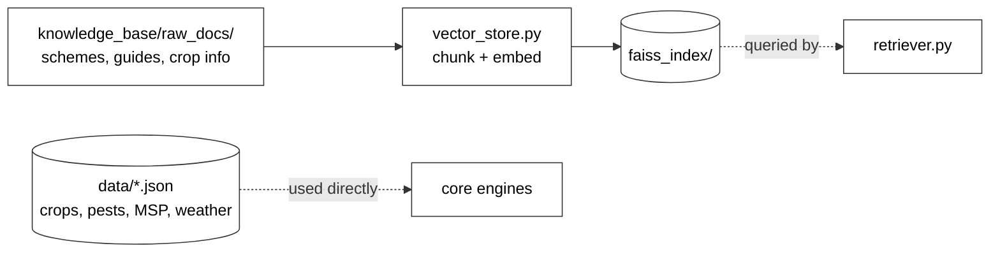

# KISAN SARTHI — Architecture & System Design

A Telegram-based agricultural advisory assistant for farmers in Bihar. Combines retrieval-augmented generation (RAG) over unstructured knowledge (government schemes, disease guides) with structured lookups (crop data, MSP prices, weather thresholds) and image-based pest detection, delivered in the farmer's own language.

## Table of contents

- [High-level architecture](#high-level-architecture)
- [Request flow](#request-flow)
- [Knowledge & data layer](#knowledge--data-layer)
- [Project structure](#project-structure)
- [Component reference](#component-reference)
- [Tech stack](#tech-stack)
- [Design notes](#design-notes)
- [Running the bot](#running-the-bot)
- [Roadmap](#roadmap)

## High-level architecture



## Request flow

A single farmer message moves through the system as follows:

1. **`src/bot/server.py`** — FastAPI app that exposes the Telegram webhook and, on startup, auto-detects a running ngrok tunnel to register itself with Telegram.
2. **`src/api/webhook_telegram.py`** receives the incoming Telegram update (text, photo, or voice), acknowledges it immediately, and hands off processing to a background task. Each update's `update_id` is checked against a short-lived dedup set to avoid double-processing retried deliveries.
3. **`src/api/message_router.py`** classifies intent — command (`/start`, `/help`, `/weather`, `/price`, `/scheme`, `/crop`), state-based follow-up, image (pest photo), voice, or free-form question — and routes accordingly.
4. **`src/api/session_manager.py`** loads/updates per-user conversation state (language, district, current crop, conversation flow state) from an in-memory store keyed by `user_id`.
5. **`src/core/chatbot.py`** orchestrates the response for free-form questions:
   - Detects Hindi vs. Hinglish/English input.
   - Pest/disease keywords or an attached photo → routed to **`pest_detection.py`** first (fast path, bypasses the LLM entirely when a confident match is found).
   - Otherwise, fetches live **weather** (`weather_service.py`) and seasonal **crop** data (`crop_engine.py`) for the farmer's district.
   - Runs **`retriever.py`** → **`vector_store.py`** to pull relevant chunks from the FAISS index (skipped for simple greetings to avoid unnecessary retrieval).
   - Assembles a structured prompt (context + system instructions + recent chat history) and sends it to **`src/services/llm_service.py`**.
6. **`src/services/llm_service.py`** is the single isolation point for the LLM provider — currently **Groq's hosted API** (`llama-3.3-70b-versatile` for text, a vision-capable model for pest photos), swapped in from an earlier local Ollama/Mistral setup. Swapping providers again only requires editing this one file.
7. Reply is sent back to the farmer via Telegram's `sendMessage` API.



## Knowledge & data layer

Ingestion is a separate, offline pipeline from the live query path:



| Store | Contents | Access pattern |
|---|---|---|
| `faiss_index/` | Embedded chunks of scheme/disease/crop documents (multilingual sentence-transformer embeddings) | Semantic search via `src/core/retriever.py` |
| `data/*.json` | Crop calendars, MSP prices, pest data, weather thresholds | Direct structured lookup — no embedding needed |

**Why the split:** RAG is reserved for genuinely unstructured, prose-form knowledge (scheme eligibility text, disease descriptions). Anything with an exact, structured answer — today's MSP for wheat, a weather alert threshold — is served straight from JSON. This keeps factual answers deterministic and avoids retrieval latency/hallucination risk where it isn't needed.

**Embedding model:** `sentence-transformers/paraphrase-multilingual-mpnet-base-v2`, run locally on CPU via `HuggingFaceEmbeddings`. Chosen for multilingual (Hindi + English) support and to keep embeddings free of any paid API dependency — this part of the stack was never dependent on Ollama and is unaffected by the LLM provider migration.

## Project structure

```
AGRI-ADVISOR/
├── src/
│   ├── api/
│   │   ├── __init__.py
│   │   ├── message_router.py      # Intent classification & routing
│   │   ├── session_manager.py     # In-memory conversation state
│   │   └── webhook_telegram.py    # Telegram webhook endpoint + dedup
│   ├── bot/
│   │   ├── __init__.py
│   │   └── server.py              # FastAPI app, ngrok auto-detection
│   ├── core/
│   │   ├── __init__.py
│   │   ├── advisory_engine.py     # Combines retrieval + engine outputs
│   │   ├── chatbot.py             # Main orchestrator
│   │   ├── crop_engine.py         # Crop calendar / recommendation logic
│   │   ├── pest_detection.py      # Image-based pest classification
│   │   ├── retriever.py           # FAISS query interface
│   │   ├── vector_store.py        # FAISS index build/load wrapper
│   │   └── weather_service.py     # Weather data + alerts
│   ├── services/
│   │   ├── __init__.py
│   │   ├── llm_service.py         # LLM provider isolation (Groq)
│   │   ├── translation_service.py # Multilingual support
│   │   └── weather_client.py      # External weather API client
│   ├── utils/
│   │   ├── __init__.py
│   │   ├── config.py              # Environment/config loading
│   │   ├── logger.py              # Logging setup
│   │   └── media_handler.py       # Image/voice download & preprocessing
│   └── web/
│       ├── __init__.py
│       └── app.py                 # Streamlit web UI (alternative to Telegram)
├── data/
│   ├── bihar_crops.json
│   ├── diseases_data.json
│   ├── govt_schemes.json
│   ├── msp_prices.json
│   ├── pest_data.json
│   └── weather_thresholds.json
├── faiss_index/                   # Persisted vector index
├── knowledge_base/
│   └── raw_docs/                  # Source documents for ingestion
│       ├── bihar_special_crops.txt
│       ├── fertilizer.txt
│       ├── maize.txt
│       ├── pest_control.txt
│       ├── rice.txt
│       ├── schemes.txt
│       ├── vegetables.txt
│       ├── weather_advice.txt
│       └── wheat.txt
├── tests/
│   └── __init__.py
├── main.py                        # Generic FastAPI entrypoint
├── main_bot.py                    # Telegram bot entrypoint (python main_bot.py)
├── main_web.py                    # Streamlit web UI entrypoint
├── requirements.txt
├── .env
└── .gitignore
```

## Component reference

| Module | Responsibility |
|---|---|
| `src/bot/server.py` | FastAPI app; on startup, detects a local ngrok tunnel and auto-registers the Telegram webhook |
| `src/api/webhook_telegram.py` | Receives Telegram updates, validates payload, dedupes by `update_id`, dispatches background processing |
| `src/api/message_router.py` | Determines intent (command, Q&A, image, price/weather lookup) and dispatches to the right handler |
| `src/api/session_manager.py` | Tracks per-user conversation state, language, district, and current crop (in-memory, TTL-based) |
| `src/core/chatbot.py` | Orchestrates retrieval + engines + LLM call, assembles the final reply |
| `src/core/retriever.py` | Embeds the query, searches the FAISS index, returns top-k relevant chunks |
| `src/core/vector_store.py` | Builds/loads the FAISS index from `knowledge_base/raw_docs/` |
| `src/core/advisory_engine.py` | Merges retrieved context with engine outputs into advice |
| `src/core/crop_engine.py` | Crop calendar, sowing/harvest recommendations |
| `src/core/pest_detection.py` | Classifies pest/disease from an uploaded photo |
| `src/core/weather_service.py` | Fetches/interprets weather data against thresholds |
| `src/services/llm_service.py` | Single isolation point for the LLM provider — currently Groq (`llama-3.3-70b-versatile` + vision model) |
| `src/services/translation_service.py` | Translates responses into the farmer's preferred language |
| `src/services/weather_client.py` | External weather API client used by `weather_service.py` |
| `src/utils/config.py` | Loads environment variables (`.env`) and app configuration |
| `src/utils/logger.py` | Centralized logging setup |
| `src/utils/media_handler.py` | Downloads and preprocesses incoming images/voice messages |
| `src/web/app.py` | Streamlit-based web chat UI, an alternative front end to Telegram |
| `main_bot.py` | Entrypoint for the Telegram bot (`python main_bot.py`) |
| `main_web.py` | Entrypoint for the Streamlit web UI |

## Tech stack

- **Bot platform:** Telegram Bot API (webhook-based, via FastAPI)
- **Web framework:** FastAPI + Uvicorn
- **LLM provider:** Groq API (`llama-3.3-70b-versatile`), isolated behind `llm_service.py`
- **Embeddings:** `sentence-transformers/paraphrase-multilingual-mpnet-base-v2` (local, CPU)
- **Vector store:** FAISS (local, file-based index)
- **Structured data:** JSON files (crop/pest/weather/scheme reference data)
- **Web UI (alternative):** Streamlit
- **Local tunneling (dev):** ngrok

## Design notes

- **RAG vs. structured lookup:** Unstructured knowledge (scheme text, disease descriptions) goes through the retriever; anything with an exact answer (MSP price, weather threshold) is served directly from `data/*.json` to keep those answers deterministic.
- **Pest detection is a separate pipeline** from text RAG — it's a vision classification step, not a retrieval step, triggered when the incoming message contains an image or pest-related keywords, and can short-circuit the LLM call entirely when confident.
- **LLM provider is fully isolated** in `llm_service.py`. The project originally ran on a local Ollama/Mistral model; it has since been migrated to Groq's hosted API for lower setup overhead and no local model-serving dependency. Swapping to a different provider again only requires editing this one file — no changes needed in `chatbot.py` or anywhere else.
- **Update deduplication:** Telegram can redeliver the same update if a response is slow; `webhook_telegram.py` tracks recently seen `update_id`s to guarantee at-most-once processing per message.
- **Ingestion is offline** — the FAISS index is built ahead of time from `knowledge_base/raw_docs/` and loaded read-only at runtime, so index updates don't block user-facing latency.

## Running the bot

1. Install dependencies: `pip install -r requirements.txt`
2. Set required environment variables in `.env`:
   - `TELEGRAM_BOT_TOKEN`
   - `GROQ_API_KEY`
   - any weather/other service keys required by `weather_client.py`
3. Start ngrok (for local development): `ngrok http 8000`
4. Start the bot: `python main_bot.py` — this will detect the running ngrok tunnel and auto-register the Telegram webhook.
5. Message the bot on Telegram to test.

> For persistent, always-on operation (not dependent on a local machine staying on), deploy `main_bot.py` to a hosting platform (e.g. Render, Railway, Fly.io) and register a permanent webhook URL instead of an ngrok tunnel.

## Roadmap

- [ ] Add retrieval quality metrics (recall@k) against a golden set of farmer questions
- [ ] Add monitoring/logging around retrieval misses and low-confidence answers
- [ ] Move session storage from in-memory to a persistent store (e.g. Redis) for multi-instance deployments
- [ ] Document all required `.env` variables in one place
- [ ] Add automated tests under `tests/` covering the Groq integration and webhook dedup logic
